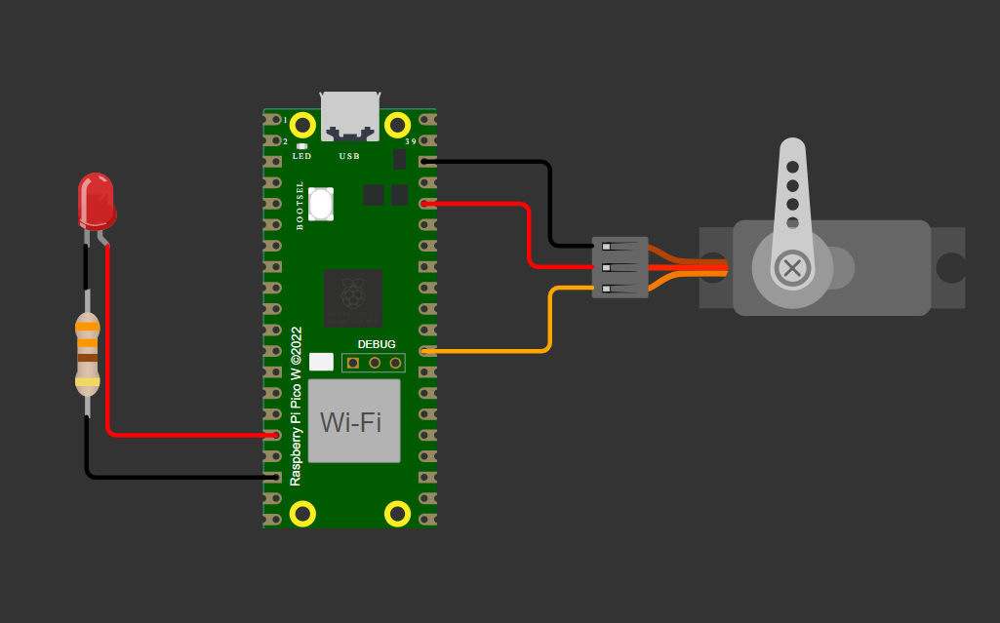

# Controle de Servo Motor e LED RGB - Capacitação Embrcatech

***Por Heitor Lemos***

## Vídeo do projeto

[Veja o vídeo no youtube](https://www.youtube.com/watch?v=7Kue5NQe5ME)

Este projeto implementa o controle de um servo motor utilizando PWM na GPIO 22, além de demonstrar o funcionamento de um LED RGB na GPIO 12 através da ferramenta BitDogLab. O código posiciona o servo em 0°, 90° e 180° e, em seguida, realiza um movimento suave entre esses ângulos.

## Clonando o Projeto

Para clonar este repositório, abra seu terminal e execute:

```bash
git clone https://github.com/TorRLD/servo_control.git
```

Depois, entre no diretório do projeto:

```bash
cd servo_control
```


## Executando o Projeto

Este projeto foi desenvolvido para ser utilizado com a extensão **Pi Pico** no Visual Studio Code. Siga os passos abaixo:

1. **Abra o projeto no Visual Studio Code.**
2. **Certifique-se de que a extensão "Pi Pico" está instalada.**
3. **Compile o projeto:**
   * Clique em **Compile** na interface da extensão.
4. **Execute o projeto:**
   * Clique em **Run** para carregar o código no seu dispositivo Pi Pico.

## Pinos Utilizados

* **GPIO 22:** Controle do Servo Motor via PWM.
* **GPIO 12:** Controle do LED RGB para o experimento com BitDogLab.

### Circuito no Wokwi



Fonte: Autor.

## Como Funciona

* **Configuração do PWM:**
  * O PWM é configurado para operar com uma frequência de 50Hz, ou seja, um período de 20ms (20.000µs).
  * Utilizando um clock de 1MHz (obtido através do divisor do clock), cada tick equivale a 1µs, permitindo definir os pulsos com precisão.
* **Posicionamento do Servo Motor:**
  * **180°:** Pulso de 2400µs (aproximadamente 12% do período).
  * **90°:** Pulso de 1470µs (aproximadamente 7,35% do período).
  * **0°:** Pulso de 500µs (aproximadamente 2,5% do período).
  * Após posicionar o servo nessas posições por 5 segundos cada, o código implementa um movimento suave que incrementa/decrementa o pulso em 5µs a cada 10ms, fazendo o servo mover-se gradualmente entre 0° e 180°.
* **Comportamento do LED RGB:**
  * O LED RGB acompanha o mesmo sinal PWM, fazendo com que sua intensidade varie de acordo com o duty cycle (razão entre o pulso ativo e o período total), demonstrando a modulação do sinal.

## Licença

Este projeto está licenciado sob a  **Licença MIT** . Consulte o arquivo [LICENSE]() para mais detalhes.
